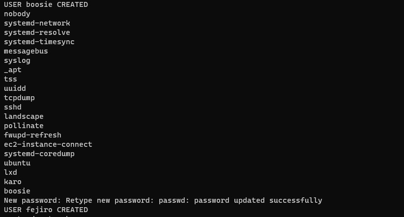

## Bash-Scripting
## Write a Bash script to onboard 20 new users to a server, the users should be added to an existing group called developers.
## The script shoud first check for the existence of the user on the server before it attempts tp create it.
## The user being created must have a default home folder
## Ensure that each user has a .ssh folder within it's home folder
## Create an authorized_Keys file in the .ssh folder of the new user and copy the public key of the current user into it

### Create your project folder "shell", go into it, create a file "names.csv" and populate it with 20 names
`mkdir shell && cd shell && touch names.csv`


### Return to your project folder and create a script named "onboard_users.sh" and make the file executable
`touch onboard_users.sh`

`sudo chmod +x onboard_users.sh`


### Create a group called "developers" where our users will be added. Use the members command to check the members of the group after creation 
`sudo group add developers`
`sudo apt members 2>/dev/null`
`sudo members developers`


### Write your script
```
#! /usr/bin/bash

cat name.csv | tr 'A-Z' 'a-z' > names.csv
PASSWORD=password
LINE=1

while read -r NAME
  do
    if id -u $NAME >/dev/null 2>&1;
    then
      echo "The user $NAME already exists"
    else
      useradd -m -d /home/$NAME -G developers $NAME
      sudo echo -e "$PASSWORD\n$PASSWORD" | sudo passwd "$NAME"
      su - -c "mkdir /home/$NAME/.ssh" $NAME
      su - -c "chmod 700 /home/$NAME/.ssh" $NAME
      su - -c "touch /home/$NAME/.ssh/authorized_keys" $NAME
      su - -c "chmod 600 /home/$NAME/.ssh/authorized_keys" $NAME
      cp -R "/home/ubuntu/.ssh/authorized_keys" "/home/$NAME/.ssh/authorized_keys"
      echo "USER $NAME CREATED"
      awk -F':' '{ print $1}' /etc/passwd | less | tail -n 20
    fi
  done < "names.csv"
```





### Log into the server as the new user wani
`ssh -i "priv.pem" wani@ec2-44-212-28-115.compute-1.amazonaws.com`


